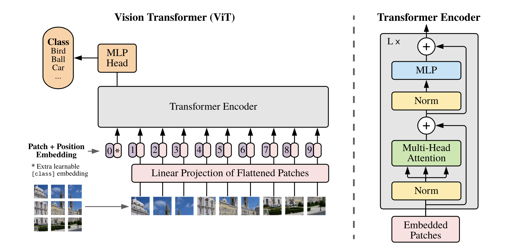

This is the implementation of ViT-Hybrid introduced in the paper titled "An Image is Worth 16x16 Words: Transformers for Image Recognition at Scale" (https://arxiv.org/abs/2010.11929).

The backbone used is EfficientNet-B2, and the weights are frozen. The ViT head is trained with "Stanford's Cars 196" dataset.

Fig.1 - ViT Architecture

